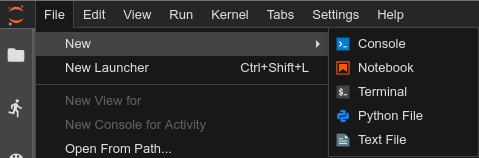
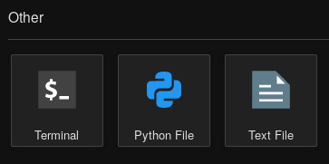

# jupyterlab-python-file

[](https://mybinder.org/v2/gh/jtpio/jupyterlab-python-file/main?urlpath=lab)
[](https://pypi.org/project/jupyterlab-python-file)
[](https://anaconda.org/conda-forge/jupyterlab-python-file)
[](https://www.npmjs.com/package/jupyterlab-python-file)

Create Python Files from JupyterLab





## Prerequisites

- JupyterLab 1.0+

## Installation

For JupyterLab 3.x, the extension can be installed with `pip`:

```bash
pip install jupyterlab-python-file
```

Or with `conda`:

```bash
conda install -c conda-forge jupyterlab-python-file

# or with mamba
mamba install jupyterlab-python-file
```

For JupyterLab 1.x and 2.x:

```bash
jupyter labextension install jupyterlab-python-file
```

## Development

Note: You will need NodeJS to build the extension package.

The `jlpm` command is JupyterLab's pinned version of
[yarn](https://yarnpkg.com/) that is installed with JupyterLab. You may use
`yarn` or `npm` in lieu of `jlpm` below.

```bash
# Clone the repo to your local environment
# Change directory to the jupyterlab-python-file directory

# create a new environment
conda create -n jupyterlab-python-file -c conda-forge python nodejs -y
conda activate jupyterlab-python-file

# install the JupyterLab pre-release
python -m pip install --pre jupyterlab

# Install package in development mode
pip install -e .

# Link your development version of the extension with JupyterLab
jupyter labextension develop . --overwrite

# Rebuild extension Typescript source after making changes
jlpm run build
```

You can watch the source directory and run JupyterLab at the same time in different terminals to watch for changes in the extension's source and automatically rebuild the extension.

```bash
# Watch the source directory in one terminal, automatically rebuilding when needed
jlpm run watch
# Run JupyterLab in another terminal
jupyter lab
```

With the watch command running, every saved change will immediately be built locally and available in your running JupyterLab. Refresh JupyterLab to load the change in your browser (you may need to wait several seconds for the extension to be rebuilt).
